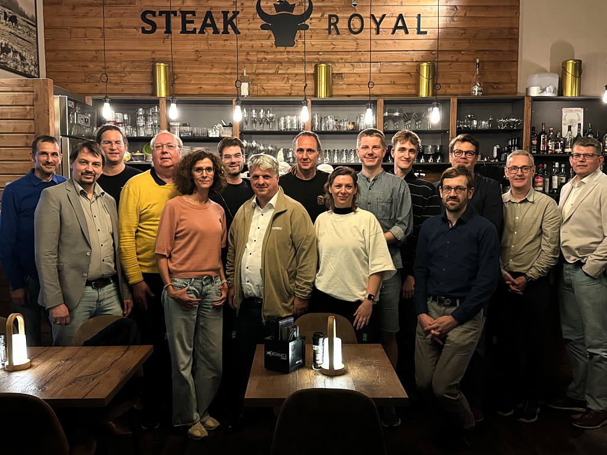

Dresden hosted three interwoven strands of OPENER Initiative and OpenDECT-X work across a single week, Tuesday to Thursday, 15 to 17 September 2026: three days of ETSI standardization, an evening among the community, and a face-to-face consortium meeting. None of it ran as one solid block of work. Sessions were repeatedly broken up, leaving plenty of room to connect.

## An evening in Dresden's city centre

Tuesday's technical sessions closed with a different kind of gathering: an OPENER Initiative social event in Dresden's historic old town, kindly sponsored by Sennheiser, followed by a walk through the city together. It set an informal, personal tone for the technical days that followed.

## Three days at the Feldschlösschen Stammhaus

From Tuesday to Thursday, ETSI TC DECT met at the Feldschlösschen Stammhaus, hosted by Last Mile Semiconductor and chaired by TC DECT Chair Jussi Numminen (Wirepas). It is a venue built for gathering rather than presenting: its traditional brewery-hall character set a tone closer to a long, shared table than a boardroom, and it left its mark on the week, three days of standardization work that felt less like a conference than a workshop.

Alongside Release 1 maintenance updates across TS 103 636 Parts 1-5, the committee approved the stable draft of the study on optimizing scheduled access (TR 104 045) and adopted a new work item on a generic time distribution service.

Beyond the decisions, the group discussed input documents for Part 6 of the DECT-2020 NR specification. Part 6 defines the common security architecture for authentication, provisioning, and key management. There were also updates on the application profiles for smart metering, cities and buildings (TS 103 874-2) and for generic audio (TS 103 874-5). Looking further ahead, the group discussed how the specification could evolve towards Release 3 and beyond, and exchanged views on a possible IMT-2030 evaluation.

On Wednesday evening, the plenary moved to a tapas bar in the city centre for a joint dinner. The format suited the room: a table of small, different plates for a group that was itself a mix of chip designers, audio experts, wireless systems engineers, and researchers, each bringing something different to share.

## The OpenDECT-X consortium, face to face

On Thursday, right after the plenary closed, the OpenDECT-X consortium met face to face, welcomed warmly by Christoph Gulich, CEO of Last Mile Semiconductor, to the company's own halls. Joined by colleagues from Sennheiser, [Deveritec](/members/deveritec/), and [Ostfalia](/members/ostfalia/), the group used the smaller setting to coordinate on the project's status and its contributions to the OPENER Initiative, and to plan upcoming activities, starting with the DECT World 2026 pre-event "Getting Started with NR+".

Three settings, one week, and rarely far from a shared table: an evening among peers, standardization work at a venue built for gathering rather than presenting, and a consortium aligning on what comes next towards DECT World 2026.
